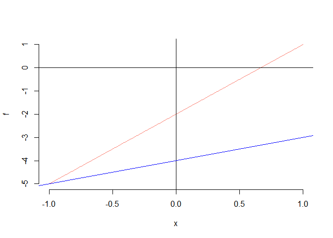
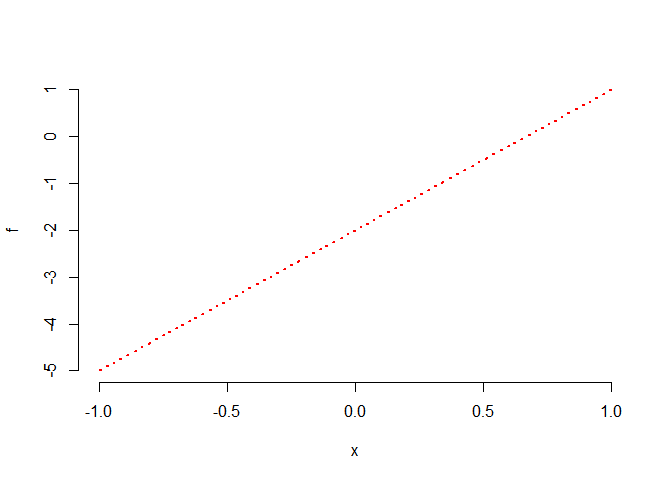
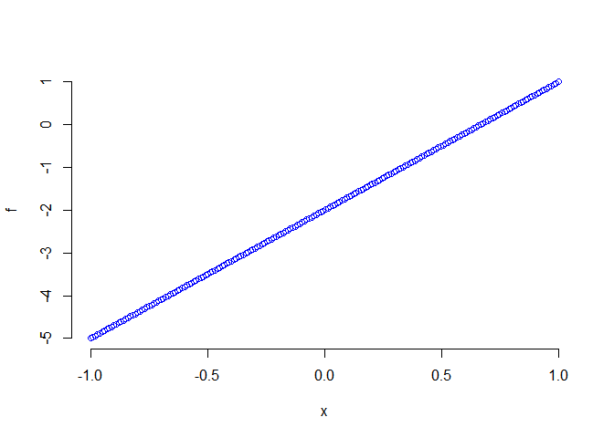
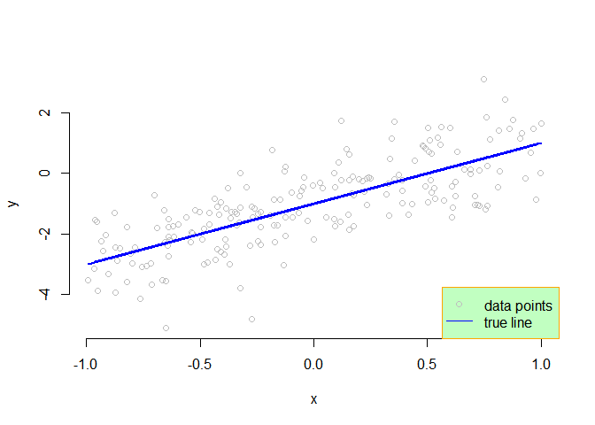

그림 그리기
================

# points, lines, abline 함수

기본적으로 그림 그리기를 시작하는 함수는 plot() 이지만, 추가적으로 점 혹은 선들을 겹쳐서 그리고 싶을 때 사용하는 함수로
points(), lines() 함수가 있다. abline() 이라는 함수는 기본적으로 plot() 함수의 그림이 그려져 있어야
하고, 그 위에 직선을 추가하는 함수이다. 그 밖에 lines(), points() 라는 비슷한 함수가 존재한다.

``` r
rm(list = ls())
n = 200
x = seq(-1, 1, length = n)
beta0 = -2
beta1 = 3
# 직선 만들기
f = beta0 + beta1 * x
plot(x, f, type = "l", bty = "n", col = "salmon")
# 수직선, 수평선 그리기, 직선 추가하기
# abline
abline(h = 0, v = 0)
abline(a = -4, b = 1, col = "blue")
```

<!-- -->

``` r
# 특정 직선을 추가하는 함수
# lines
plot(x, f, type = "n", bty = "n")
lines(x, f, col ="red", lwd = 2, lty = 3)
```

<!-- -->

``` r
# 점을 추가하는 함수
# points
plot(x, f, type = "n", bty = "n")
points(x, f, col = "blue", cex = 1, pch = 1)
```

<!-- -->

# 범례 그리기 legend

``` r
rm(list = ls())
n = 200
x = runif(n, -1, 1)  # runif : 균등분포에서 난수 생성
f = -1 + 2 * x  # 직선 생성

# 직선으로부터 오차를 추가해서 만들어진 데이터 생성
error = rnorm(n)
y = f + error
plot(x, y, type = "p", bty = "n", col = "gray")
lines(x, f, col = "blue", lwd = 2)  # 중심 직선 생성
# legend
# legend 기본위치 지정 방법 2가지
# 자동 위치 지정: "topleft", "topright", "bottomleft", "bottomright"
# 수동 위치 지정: 옵션에서 x, y축의 위치원소를 지정 
# 여러 개의 legend 를 쓴다면 옵션들을 벡터의 형식으로 지정
legend("bottomright", legend = c("data points", "true line"), 
       col=c("gray", "blue"), 
       pch = c(1, NA),  # 점에 대한 옵션을 안 주고 싶을 떄 NA
       lty = c(NA, 1),  # 선에 대한 옵션
       bty = "o", box.col = "orange", bg = "darkseagreen1")
```

<!-- -->

# 추세선(단순선형회귀직선) 적합시키기

아래의 수식은 단순선형회귀모형이다. \[
y_i = \beta_0 + \beta_1 x_i + \epsilon_i,
\quad i = 1, \ldots, n
\] 즉, 설명변수 \(x\) 와 반응변수 \(y\) 가 직선관계에 있다고 가정을 한 단순선형회귀모형이다. 이때,
\(\epsilon \sim N(0,1)\)은 오차이다. 추세선 혹은 단순선형회귀직선은 주어진 \(n\)개의 짝 지어진 자료 \[
(x_i, y_i), \ldots, (x_n, y_n)
\] 을 가지고 \(\beta_0\)오 \(beta_1\)을 추정하는 문제이다.
